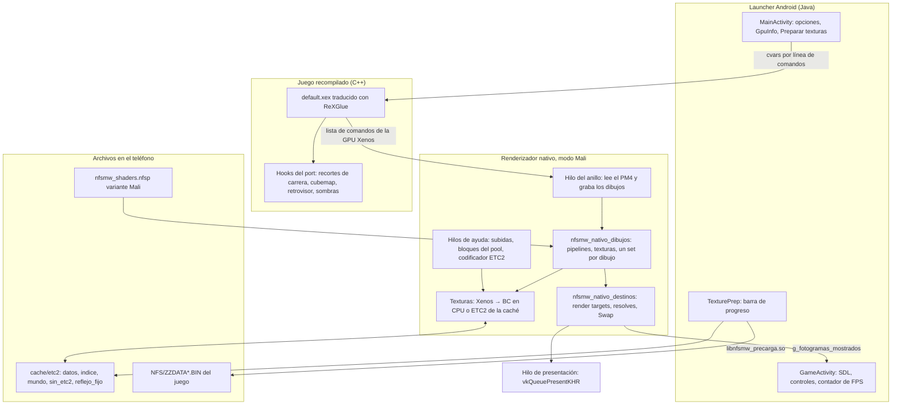
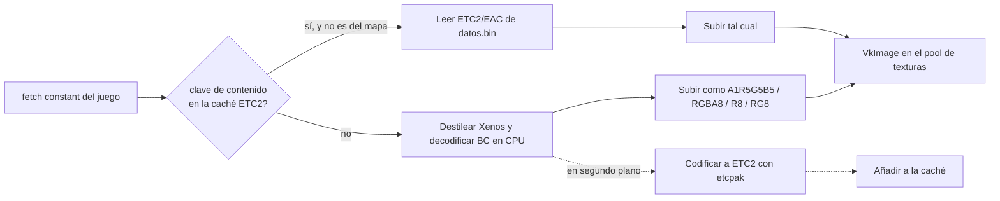

# Backend gráfico para Mali (modo Mali del renderizador nativo)

Este documento explica cómo el port dibuja Need for Speed: Most Wanted en GPUs Mali de gama baja, en concreto la
**Mali-G52 MC2**. Cubre la arquitectura, el recorrido de un fotograma y de una textura, y todos los hacks y
mejoras que hicieron falta para que el juego corra y sea jugable. Las decisiones tomadas por el camino y los
callejones sin salida están en [plan-backend-mali.md](plan-backend-mali.md),
[plan-backend-mali-handoff.md](plan-backend-mali-handoff.md) y
[diagnostico-crash-mali-g52.md](diagnostico-crash-mali-g52.md).

## Dispositivo de referencia

Todo lo de este documento se desarrolló y midió en un **Samsung Galaxy A32 4G (2021)**.

### CPU: MediaTek Helio G80

| | |
|---|---|
| Núcleos | 8: **2 × Cortex-A75 a 2,0 GHz** (los grandes) + **6 × Cortex-A55 a 1,8 GHz** (los pequeños) |
| Arquitectura | ARMv8.2-A, 64 bits (`arm64-v8a`), con NEON |
| Fabricación | 12 nm |

Lo importante para el port:

- **Solo hay dos núcleos rápidos.** El juego reparte su trabajo en varios hilos, pero el que manda es el del
  anillo, que graba los dibujos (~20 µs por dibujo). Si cae en un A55 o lo desplaza otro hilo, el FPS se
  desploma. Por eso el juego se fija a los núcleos grandes y el anillo y la presentación corren con `nice -10`.
- La CPU, no la GPU, es el cuello de botella en carrera: decodificar texturas BC en la CPU competía con el
  anillo, y por eso la caché ETC2 rinde tanto.
- El orden de memoria de ARM es más débil que el de x86 (y que el de la Xbox 360 vista desde el código
  recompilado): un productor/consumidor del juego sin barreras crasheaba (ver "Compatibilidad").

### GPU: Mali-G52 MC2

| | |
|---|---|
| Arquitectura | Bifrost, 2 núcleos de shader (MC2) |
| Renderizado | **TBDR** (por tiles): borrar o cargar un destino al abrir el pase es gratis; leer o borrar a mitad de pase es caro |
| Formatos comprimidos | **ETC2/EAC sí**; **BC1-BC5 (DXT) no** |
| Precisión | FP16 a doble velocidad (medido sin ganancia en este juego) |
| Timestamps | No (`timestampValidBits = 0`): el tiempo de GPU se mide con fences |

### API: Vulkan 1.1.131

| | |
|---|---|
| Driver | `ArmProprietary v1.r26p0-01eac0` (2020) |
| Versión | **Vulkan 1.1.131**, no 1.2 |
| SPIR-V | Hasta **1.4**, gracias a `VK_KHR_spirv_1_4`. Los shaders se compilan con `-fspv-target-env=vulkan1.1spirv1.4`; el SPIR-V 1.5 de Vulkan 1.2 no carga |
| `maxBoundDescriptorSets` | **4** (el nativo usaba 5: el driver se colgaba en vez de dar error) |
| `maxPerStageDescriptorSampledImages` | **256** (el nativo usaba un montón de 4096) |
| `maxPerStageDescriptorSamplers` | **128** (el nativo usaba 512) |
| MSAA | Hasta 4× en color y profundidad |

Lo que la GPU **tiene** y el modo Mali aprovecha: `shaderSampledImageArrayDynamicIndexing` (indexar un array
de texturas *acotado* con un índice dinámico, la base del set por dibujo), `textureCompressionETC2`,
`fragmentStoresAndAtomics`, `independentBlend`, `samplerAnisotropy`, `geometryShader` y `tessellationShader`.

Lo que **no tiene** y el renderizador nativo de las demás plataformas necesita:

| Falta | Para qué lo usaba el nativo |
|---|---|
| `shaderInt64`, `bufferDeviceAddress` | Leer las constantes de los shaders por un puntero de 64 bits |
| `runtimeDescriptorArray`, `descriptorBinding*` (bindless, update-after-bind) | Un montón global de 4096 texturas que se escribe mientras la GPU lo lee |
| Muestreo de BC1-BC5 (DXT) | Las texturas del juego van en BC; la Mali no las muestrea |
| `vertexPipelineStoresAndAtomics`, `fillModeNonSolid` | memexport desde vertex shaders y relleno en líneas |

## Por qué un modo propio

Había dos renderizadores y ninguno servía en esta GPU:

- **El nativo** (el de la Switch y de las GPU potentes) exige Int64, BDA y bindless. Además su layout de 5
  descriptor sets supera `maxBoundDescriptorSets = 4`: el driver Mali no devuelve un error, **se cuelga dentro
  de `vkCreatePipelineLayout`**.
- **El portable de Xenia** arranca, pero el driver se cuelga compilando los shaders traducidos en tiempo de
  ejecución.

La solución fue un **sub-modo del renderizador nativo**: se reutiliza todo lo que no depende de la GPU (lectura
de la lista de comandos del juego, decodificación y caché de texturas Xenos, pipelines precompiladas en el
`.nfsp`), y se cambian solo las piezas que la Mali no soporta. Se activa solo (`nfsmw_nativo_mali = -1`) cuando
el dispositivo no tiene Int64/BDA/bindless pero sí indexado dinámico de arrays. Ningún cambio altera PC, Adreno,
Xclipse ni Switch: todo va detrás de `modo_mali_`, de Android o de cvars que vienen apagados.

## Arquitectura



Piezas principales:

| Archivo | Qué hace |
|---|---|
| `app/src/nfsmw_nativo_dibujos.cpp` | Corazón del renderizador: decide el modo Mali, crea pipelines, resuelve texturas desde las fetch constants del juego, arma un descriptor set por dibujo y graba los comandos. |
| `app/src/nfsmw_nativo_destinos.cpp` | Render targets, copias y resolves del EDRAM, borrados, y el Swap que entrega la imagen al presentador. |
| `app/src/nfsmw_nativo_sistema.cpp` | Ciclo de vida, informes periódicos y medición de tirones. |
| `app/src/nfsmw_cache_etc2.cpp`, `nfsmw_etc2_codificar.cpp` | Caché en disco de texturas ETC2/EAC y codificador en segundo plano (etcpak). |
| `app/src/nfsmw_tpk.cpp`, `nfsmw_precarga_etc2.cpp`, `nfsmw_precarga_jni.cpp` | "Preparar texturas": lee los packs del juego y llena la caché antes de jugar (`libnfsmw_precarga.so`). |
| `app/src/nfsmw_recortes_carrera.cpp` | Hooks que recortan trabajo durante la carrera: cubemap del coche, retrovisor y reflejo del asfalto. |
| `shaders/XenosRecomp/shader_common.h` (y sus dos copias) | Variante `NFSMW_MALI` de los shaders. |
| `tools/biblioteca_shaders_mali.mjs` | Arma el `.nfsp` Mali. |
| `sdk/src/ui/vulkan/vulkan_device.cpp` | Lectura de las features de Vulkan 1.0 en un dispositivo 1.1, y habilitación de ETC2. |
| `android/.../GpuInfo.java`, `GameOptions.java`, `MainActivity.java`, `GameActivity.java`, `TexturePrep.java` | Detección de la GPU, perfil ligero, opciones, preparación de texturas y contador de FPS. |

## Flujo de un fotograma

1. **El juego graba sus comandos** como en una Xbox 360: una lista de paquetes PM4 para la GPU Xenos, con
   registros, fetch constants (texturas) y shaders por su huella.
2. **El hilo del anillo** (`GPU anillo nati`) lee esa lista. Corre con `nice -10` y solo en los núcleos grandes,
   porque es el cuello de botella de CPU: unos 20 µs por dibujo.
3. **Por cada dibujo** (`nfsmw_nativo_dibujos.cpp`):
   - busca la pipeline por su clave (shaders, estado de mezcla y profundidad, formato del destino). Todas salen
     del `.nfsp` Mali y se precalientan al arrancar, así que no se compila nada en mitad de la carrera;
   - resuelve cada textura desde su fetch constant (ver el flujo de texturas) y su sampler;
   - **arma un descriptor set propio** con hasta 32 texturas 2D, 32 3D, 16 cubos y 16 samplers en ranuras
     locales (una por registro de fetch, más 16 + registro para el par sombra/3D). Los sets salen de un pool por
     ranura de trabajo que se resetea al reciclarla, y se cachean por contenido;
   - escribe las constantes en un UBO dinámico (set 1) en vez de pasarlas por puntero;
   - graba el dibujo.
4. **Pases y destinos** (`nfsmw_nativo_destinos.cpp`): los borrados se aplazan al `loadOp` del pase siguiente
   que usa ese destino, y las dependencias entre pases no paran la GPU en la etapa de vértices. Así se aprovecha
   el renderizado por tiles.
5. **Envío**: hay 3 ranuras de trabajo en vuelo, cada una con su búfer de subida de 32 MB. Las subidas de
   texturas van en su propio command buffer, antes del trabajo.
6. **Swap**: la imagen resuelta se pinta en la salida y se suma `g_fotogramas_mostrados`, el contador del FPS en
   pantalla. En Mali, `vkQueuePresentKHR` espera a la GPU, así que en GPUs de gama baja la presentación corre en
   un hilo propio (`present_hilo_propio`, también con `nice -10`) y el anillo no se queda esperando.

## Flujo de una textura



- **Clave**: la misma que calcula el juego en tiempo de ejecución, a partir de la forma de la textura y la
  huella de sus bytes. Por eso se puede llenar la caché sin jugar: "Preparar texturas" calcula esa clave
  directamente desde los archivos del juego, y comprueba que el resultado coincide byte a byte.
- **Con caché**: la imagen se crea en ETC2 (BC1 → ETC2 RGB, BC2/BC3 → ETC2 RGBA, BC4 → EAC R11, BC5 → EAC
  RG11), que la Mali muestrea de forma nativa, con la mitad o la cuarta parte de memoria que el RGBA
  decodificado y sin trabajo de CPU. Las BC1 con texels transparentes no se guardan, porque etcpak no hace
  punch-through, y siguen por la vía de decodificación.
- **Sin caché**: el texel se destilea, se decodifica en la CPU y se sube. BC1 va a A1R5G5B5 (2 bytes por texel
  en vez de 4). Mientras tanto, un hilo de fondo codifica la textura a ETC2 para la próxima vez.
- **El mapa nunca pasa a ETC2.** El minimapa reescribe sus recuadros en la misma memoria. `sin_etc2.bin` lista
  las claves de TRACKMAPS, `MINIMAP*` y `*WORLDMAP*`, que siempre se decodifican. Si cualquier imagen ETC2
  recibe un contenido que la caché no tiene, se retira con destrucción diferida y se recrea por la vía de
  decodificación.
- **Calidad de texturas** (Media/Baja): se omiten los 1 o 2 mips más grandes, **solo de las texturas del
  mundo** (`mundo.bin`). Autos, vinilos, logos, menús, iconos y HUD nunca bajan de calidad.
- **Memoria**: tope de 256 MB para la caché de texturas. El pool reparte bloques de 16 MB, llena primero los más
  llenos y devuelve los vacíos tras 120 fotogramas. Los bloques se reservan y liberan en un hilo propio, porque
  el driver los toca enteros.

### Preparar texturas

El botón del launcher (solo en Mali y con la carpeta del juego válida) carga `libnfsmw_precarga.so` y:

1. lee el índice `ZDIR.BIN` y recorre los `ZZDATA*.BIN`. Los packs de texturas (TPK) vienen comprimidos con
   JDLZ o con el Huffman de EA (`HUFF`, decodificador del código liberado de C&C Generals), y el mundo va en
   bloques por secciones;
2. con un lector y varios hilos de trabajo, calcula la clave de cada textura, la codifica a ETC2 y la añade a
   `cache/etc2/datos.bin` + `indice.bin`;
3. escribe `mundo.bin` (texturas del mundo, las únicas que baja la opción de calidad), `sin_etc2.bin` (el mapa)
   y `reflejo_fijo.bin` (el panorama de la ciudad para el reflejo fijo).

La primera vez tarda varios minutos. Después solo procesa lo que falte.

## Shaders: la variante `NFSMW_MALI`

El `.nfsp` normal no sirve en la Mali. La variante se arma con `#define NFSMW_MALI 1` en `shader_common.h`:

- sin `uint64_t` ni `vk::RawBufferLoad`: las constantes van siempre por UBO (set 1);
- arrays de texturas **acotados** e indexados con la ranura local del dibujo, en el set 0;
- SPIR-V 1.4 (`-fspv-target-env=vulkan1.1spirv1.4`), validado con `spirv-val`. Se rechaza cualquier módulo que
  declare `Int64`, `RuntimeDescriptorArray` o `PhysicalStorageBufferAddresses`.

Sin el macro, la biblioteca sale byte a byte igual a la oficial. El instalador dentro del teléfono usa DXC en
WASM, fijo en Vulkan 1.2, así que la variante Mali se arma en la PC:

```bash
node tools/biblioteca_shaders_mali.mjs <carpeta del juego, o adb:> out/nfsmw_shaders_mali.nfsp
```

Requiere el DXC nativo en WSL y el `spirv-val` del NDK. El resultado se copia al teléfono como
`nfsmw_shaders.nfsp` en la carpeta del juego. Con `--fp16` se marca RelaxedPrecision en la aritmética de los
fragment shaders; medido A/B en la misma escena no ganó nada, así que no se usa por defecto.

## Hacks y mejoras

Todo lo siguiente solo se aplica en modo Mali o en Android, salvo que se indique.

### Compatibilidad: que arranque y dibuje

| Problema | Arreglo |
|---|---|
| Las features de Vulkan 1.0 (`shaderInt64`, `shaderSampledImageArrayDynamicIndexing`, `pipelineStatisticsQuery`) solo se leían si la API era ≥ 1.2, y la Mali es 1.1 | Se leen fuera de ese guard (`vulkan_device.cpp`). Sin esto no se detectaba ni el modo Mali. |
| Bucle infinito de access violation en el decodificador de video del juego: una página de guarda quedaba sin acceso en el host tras liberar y volver a reservar | `xmemory.cpp` fuerza la protección del host al reservar (afecta a todas las plataformas; corrige un bug real) |
| Cuelgue en `vkCreatePipelineLayout` con 5 sets | Layout de 4 sets (luego 2: texturas y UBO) y un chequeo de `maxBoundDescriptorSets` que falla limpio en vez de colgar |
| Sin bindless ni update-after-bind | Un descriptor set por dibujo, ranuras locales, pools por ranura de trabajo, vistas retiradas con destrucción diferida |
| Sin Int64/BDA | Constantes por UBO y búfer de subida sin `SHADER_DEVICE_ADDRESS` |
| La Mali no muestrea BC y copiar a una imagen BC crasheaba el driver | BC1-BC5 decodificados en la CPU (luego, ETC2 desde la caché) |
| `DEVICE_LOST` al cargar una carrera | El espacio de subida se estimaba con el tamaño comprimido y la copia pisaba los vértices del fotograma. Ahora se usa el tamaño decodificado y, si no hay sitio, la subida se aplaza. |
| Condiciones de carrera entre transferencias (validation layers) | Barreras TRANSFER→TRANSFER tras copias, blits y borrados, y una barrera completa al empezar cada trabajo |
| Videos de la intro rotos | Decodificador VC-1/WMV3 de FFmpeg activado para Android arm64 |
| Crash "Call to invalid function at 0x00000000" en la lista de comandos del juego | Orden de memoria de ARM: el preparador publicaba el contador antes que la entrada. Hook con barreras release/acquire (solo Android). |

### Memoria: los congelones al ir rápido eran RAM

Los tirones de 100-450 ms al acelerar coincidían con `lmkd` cerrando apps y con swap en zram: el juego tenía
~1,08 GB de memoria gráfica. Con estos cambios bajó a ~0,71 GB:

- BC1 decodificada a **A1R5G5B5** en vez de RGBA8 (`nfsmw_nativo_mali_bc1_16bits`);
- caché de texturas con tope de **256 MB** (`nfsmw_nativo_mali_texturas_mb_max`);
- búferes de subida de **32 MB** en vez de 64 (`nfsmw_nativo_mali_subida_mb`);
- pool de texturas que compacta y devuelve bloques vacíos;
- **caché ETC2**: las texturas ocupan lo mismo que en BC y no gastan CPU;
- búfer de decodificación reciclado: pedir uno nuevo por textura causaba el 62 % de los fallos de página del
  anillo.

Resultado: reclamos de `lmkd` 180 → 15 y segundos con tirones de más de 400 ms 21 → 7.

### CPU e hilos

- **El anillo solo en los núcleos grandes** (`nfsmw_android_nucleos_grandes`) y con `nice -10`
  (`nfsmw_android_nice_anillo`): perdía el A75 frente a otros hilos. En carrera, de 23 a ~30 fps.
- **Presentación en un hilo propio** en GPUs de gama baja (`present_hilo_propio`), también con `nice -10`. Tirones
  de ≥100 ms: de ~17,6 a ~4,7 por minuto.
- **SDL ya no ocupa un núcleo**: `SDL_WaitEvent` giraba al 100 % en un A75. El bucle de eventos duerme hasta que
  hay eventos, como mucho 4 ms, y el bombeo por `XInputGetState` se limita a uno cada 4 ms.
- La capa táctil se redibuja como mucho a 30 Hz.
- Tabla de samplers de 16384 casillas: menos choques en la caché de samplers.
- Bloques del pool de texturas reservados y liberados fuera del anillo.

### GPU: menos trabajo por fotograma

- **Sin mapa de sombras** por defecto (`nfsmw_nativo_mali_sin_sombras`): además se veía como un rectángulo oscuro
  delante del auto. Se puede volver a activar desde el launcher.
- **Borrados dentro del pase** (`nfsmw_nativo_mali_borrado_en_pase`): un `vkCmdClearAttachments` o un pase extra
  es caro en una GPU por tiles, mientras que un `loadOp = CLEAR` es gratis.
- **Sin burbuja entre pases** (`nfsmw_nativo_mali_sin_burbuja`): las dependencias no esperan a los vértices.
- **Reflejos del coche** (`nfsmw_cubemap_contenido`): completo, solo cielo, reflejo propio (una ronda de 6 caras
  cada 3 s), desactivado, o **cubemap fijo**.
- **Cubemap fijo (ciudad)**, la idea del `env_cubemap` de Source: las caras del cubemap dinámico no se dibujan
  nunca. El renderizador reconoce el cubo del coche por su forma (8888, 256×256, sin mips) y le pone un cubemap
  de 128×128 armado en la CPU con el panorama de Rockport que el juego usa en las ventanas de los edificios
  (`WINDOWREFLECTIONCOL`). El panorama rodea el horizonte, se espeja cada media vuelta para no tener costura y se
  funde con el color del cielo arriba y del suelo abajo. El shader del auto aclara mucho lo que refleja, así que
  el brillo se atenúa (`nfsmw_cubemap_fijo_brillo`, 25 % por defecto). Cuesta lo mismo que no tener reflejos.
- **Retrovisor** cada 2 fotogramas en Mali, o apagado (`nfsmw_retrovisor_cada`). Apagado, tampoco se dibuja el
  cuadro del HUD que lo muestra.
- **Reflejo del asfalto** bajo demanda y opcional.
- **Calidad de texturas** que baja solo el mundo, y **resolución interna** 1024×576 por defecto en GPUs débiles.

### Launcher

- `GpuInfo` detecta la GPU por el `GL_RENDERER` y aplica un **perfil ligero** en GPUs débiles (Mali-G31/G51/G52/
  G57, Mali antiguas, Adreno < 600, PowerVR). Es solo el punto de partida: lo que elija el jugador manda.
- Opciones nuevas: calidad de texturas, contenido de los reflejos, brillo del cubemap fijo, retrovisor y
  **Mostrar FPS**. Esta última también se puede cambiar dentro del juego, desde Ajustes.
- **Preparar texturas**, con barra de progreso y cancelación.
- **Contador de FPS**: cuenta las imágenes que el juego entrega a la pantalla sobre el tiempo real, cada medio
  segundo, y parte de una lectura nueva al activarlo o al volver a la app.

## Resultados en el Galaxy A32 4G

| Momento | Estado |
|---|---|
| Inicio del trabajo | Pantalla negra, o cuelgue del driver |
| Primer dibujo | Menú visible, sin texturas BC; `DEVICE_LOST` al cargar una carrera |
| Un set por dibujo + BC en CPU | Menú, iconos y carrera rápida correctos |
| Memoria y hilos | Jugable: ~25-27 fps en carrera, ~32 fps de media en modo libre |
| Caché ETC2 + cubemap fijo | Fluido según el usuario, sin congelones al cargar zonas |

Para comparar FPS conviene usar siempre la misma carrera: contra tres rivales rinde menos que contra uno solo.

## Medir y diagnosticar

- **Tirones**: las líneas `[tiron]` del log desglosan cada tirón con `getrusage` y `schedstat` del hilo del
  anillo y qué hilos usaron CPU. Para la RAM: `adb shell dumpsys meminfo com.nfsmw.android` y `lmkd` en el
  logcat.
- **GPU sin timestamps**: `nfsmw_nativo_desglose_por_fence` reparte el tiempo de GPU por categoría usando fences.
- **Coste de un efecto**: `nfsmw_nativo_mali_ab_omitir_ps` salta los dibujos de un pixel shader cada 10 s (A/B).
- **Memoria de la GPU**: `nfsmw_nativo_mali_diag_memoria` cuenta cada `vkAllocateMemory` por origen.
- **Caché ETC2**: `nfsmw_nativo_diag_claves_etc2` anota la fetch constant y la clave de cada textura.
- Los logs y el `nfsmw.toml` del teléfono solo se leen con `run-as`, que exige un APK con `debuggable true`.
  Ese cambio es temporal y nunca va en una versión publicada.

## Conocido y pendiente

- A 640×360 el juego crashea al entrar a la partida. Se probó bien a 1024×576 y 1280×720.
- Los shaders embebidos del resplandor (`kSpirvResplandor*`) y el video por Vulkan no son compatibles con Mali.
- El manejador de excepciones reintenta para siempre un SIGSEGV del host dentro del driver en vez de abortar.
- El cuello en carrera sigue siendo la CPU del anillo (~20 µs por dibujo): hay margen en el coste por pipeline
  y por llamada al driver.
- Cubemaps fijos por zona: la posición de la cámara ya está localizada (`eView + 0x40`, Z hacia arriba), así que
  se podrían usar varios panoramas según dónde esté el coche.
